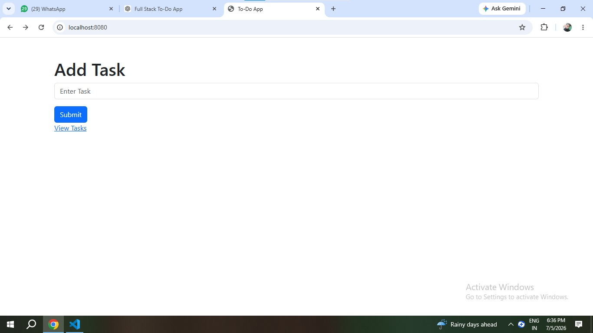
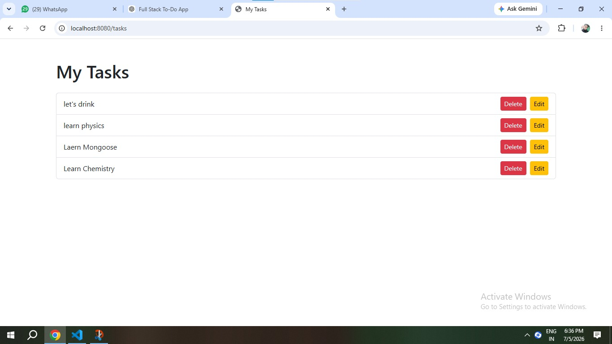
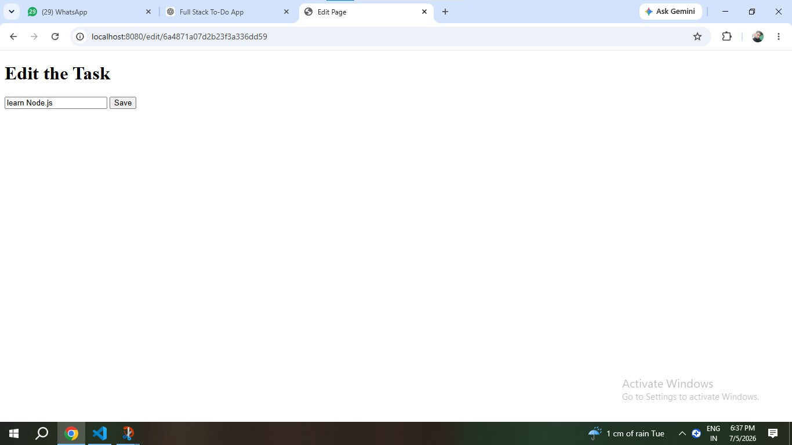

# Todo List MVC

A Task Management Web Application built using Node.js, Express.js, MongoDB, Mongoose, EJS, and the MVC Architecture.

## Features

- Add new tasks
- View all tasks
- Edit existing tasks
- Delete tasks
- Store tasks in MongoDB
- MVC Architecture

## Tech Stack

- Node.js
- Express.js
- MongoDB
- Mongoose
- EJS
- HTML
- CSS

## Installation

1. Clone the repository

```bash
git clone https://github.com/Shivendra1234-tech/todo-list-mvc.git
```

2. Navigate to the project folder

```bash
cd todo-list-mvc
```

3. Install dependencies

```bash
npm install
```

4. Start the application

```bash
node app.js
```

5. Open your browser and visit

```
http://localhost:8080
```

## Project Structure

```
todo-list-mvc/
│
├── controllers/
│   └── taskControllers.js
│
├── models/
│   └── Task.js
│
├── routes/
│   └── taskRoutes.js
│
├── views/
│   ├── index.ejs
│   ├── tasks.ejs
│   └── edit.ejs
│
├── app.js
├── package.json
├── .gitignore
└── README.md
```

## Future Improvements

 Add task categories (Work, Personal, Study)
 Add task due dates and reminders
 Add task priority (High, Medium, Low)
 Add search and filtering
 Improve the UI with responsive design

## Screenshots

### Home Page



### Tasks Page



### Edit Page

